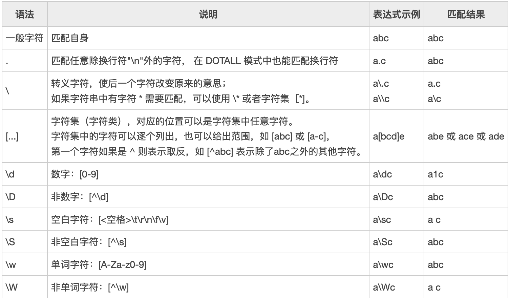
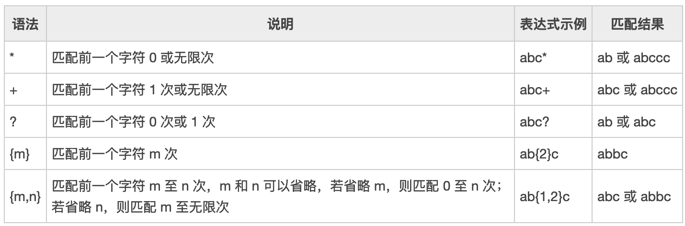
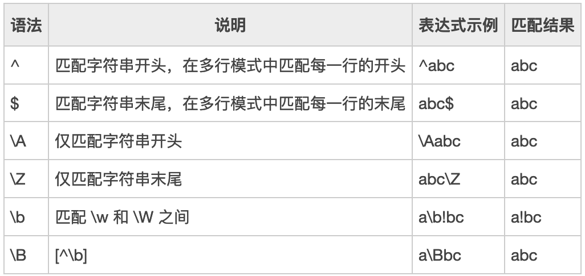
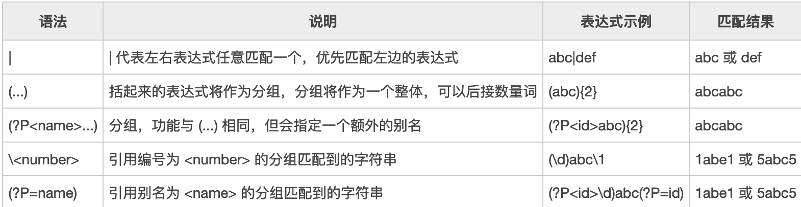
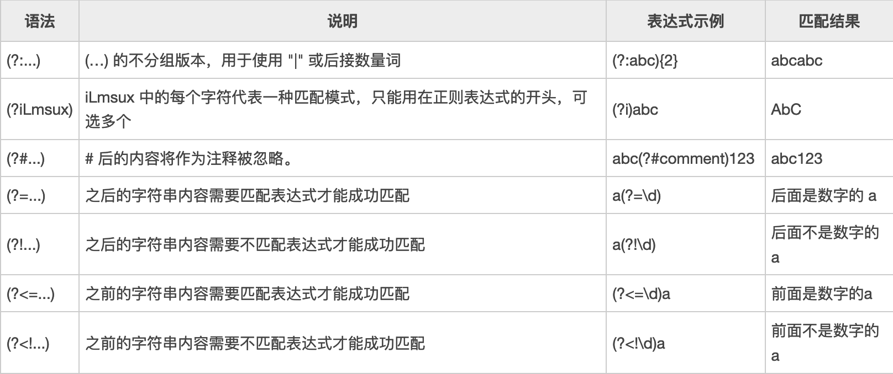

# Go语言正则基本说明

``` go 
//正则结构体
type Regexp struct {
        // contains filtered or unexported fields
}

//初始化结构体对象的方法
func Compile(expr string) (*Regexp, error)
//和Compile函数相似，但是该方法支持POSIX协议，可以支持类似`egrep`的语法
func CompilePOSIX(expr string) (*Regexp, error)

//Must系列函数和上面两个函数相似，但是不会返回error,如果有异常直接panic
func MustCompile(str string) *Regexp
func MustCompilePOSIX(str string) *Regexp


//结构体方法.常用的几个
//在字符串s中查找完全匹配正则表达式re的字符串.如果匹配到就停止不进行全部匹配，如果匹配不到就输出空字符串
func (re *Regexp) FindString(s string) string

//在字符串s中匹配re表达式，n表示匹配的次数，-1表示匹配整个字符串。返回字符串切片
func (re *Regexp) FindAllString(s string, n int) []string

//在src中匹配re，并替换为repl，该种方式中repl中的$符号会展开实际的变量，通常用在回溯查找中
func (re *Regexp) ReplaceAllString(src, repl string) string

//在src中匹配re，并替换为repl,该方法会按照repl中的字面意思进行替换，不支持高级变量匹配，比如回溯等等
func (re *Regexp) ReplaceAllLiteralString(src, repl string) string


//在字符串中是否匹配到re定义的字符串，匹配返回true
func (re *Regexp) MatchString(s string) bool
```
# 正则表达式规则说明
## 1) 字符


## 2) 数量词（用在字符或 (...) 之后）


## 3) 边界匹配


## 4) 逻辑、分组


## 5) 特殊构造（不作为分组）
